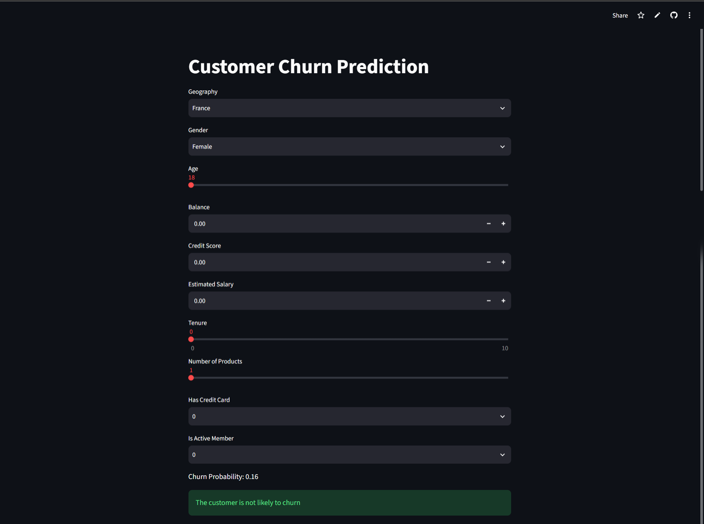

# ANN Classification – Customer Churn Prediction

An Artificial Neural Network (ANN) based machine learning project for predicting whether a customer is likely to churn.

## 🚀 Live Demo

**[Open the Streamlit App](https://ann-classification-customer-churn-model-lgcwmhqb9qehrdvkqedfgr.streamlit.app/)**


## 📌 Project Overview

Customer churn prediction is a binary classification problem where the goal is to identify customers who are likely to leave a service.

This project uses an Artificial Neural Network built with TensorFlow/Keras to predict customer churn based on customer information.

The project covers the complete workflow from data preprocessing and feature transformation to model training, prediction, and deployment.

## 🧠 Machine Learning Workflow

```text
Customer Data
      ↓
Data Preprocessing
      ↓
Categorical Encoding
      ↓
Feature Scaling
      ↓
ANN Model
      ↓
Churn Probability
      ↓
Streamlit Web App
```

## 🛠️ Technologies Used

* Python
* TensorFlow
* Keras
* NumPy
* Pandas
* Scikit-learn
* Streamlit
* Matplotlib
* Seaborn

## 📊 Features

* Customer churn classification
* Categorical feature encoding
* Numerical feature scaling
* ANN-based prediction
* Churn probability output
* Interactive Streamlit interface
* Deployed live using Streamlit Community Cloud

## 📂 Project Structure

```text
├── app.py
├── model.h5
├── encoder.pkl
├── ohe.pkl
├── scaler.pkl
├── Churn_Modelling.csv
├── requirements.txt
├── experiments.ipynb
├── prediction.ipynb
├── README.md
└── LICENSE
```

## 🤖 Model

The project uses an Artificial Neural Network implemented with TensorFlow/Keras.

The trained model is stored in:

```text
model.h5
```

The preprocessing objects used during prediction are stored as:

```text
encoder.pkl
ohe.pkl
scaler.pkl
```

This allows the Streamlit application to use the same preprocessing steps during inference.

## 🌐 Streamlit Application

The deployed application allows users to enter customer information and receive a churn prediction.

### Input Features

* Geography
* Gender
* Age
* Balance
* Credit Score
* Estimated Salary
* Tenure
* Number of Products
* Has Credit Card
* Is Active Member

### Output

The application provides:

* Churn probability
* Churn prediction

## ▶️ Run Locally

Clone the repository:

```bash
git clone git@github.com:samarth3868-coder/ANN-CLASSIFICATION-CUSTOMER-CHURN-MODEL.git
```

Move into the project directory:

```bash
cd ANN-CLASSIFICATION-CUSTOMER-CHURN-MODEL
```

Install dependencies:

```bash
pip install -r requirements.txt
```

Run the Streamlit application:

```bash
streamlit run app.py
```

## 🔗 Links

**GitHub Repository:**
https://github.com/samarth3868-coder/ANN-CLASSIFICATION-CUSTOMER-CHURN-MODEL

**Live Streamlit App:**
https://ann-classification-customer-churn-model-lgcwmhqb9qehrdvkqedfgr.streamlit.app/
